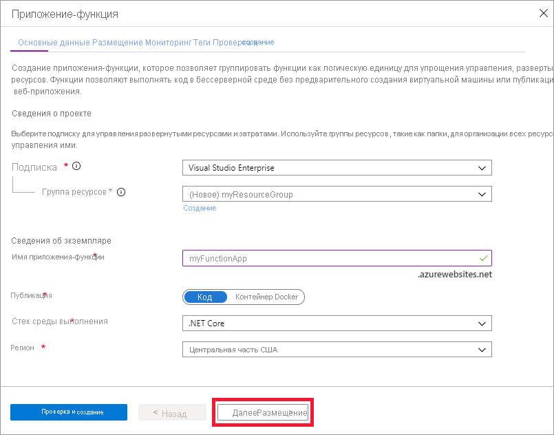
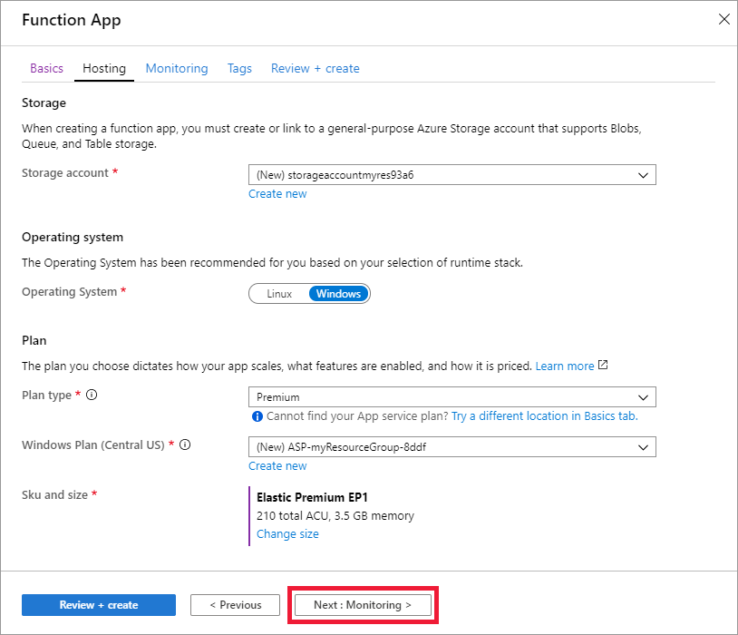

1. Откройте портал Azure из[https://portal.azure.com](https://portal.azure.com)

1. Нажмите кнопку **Создать ресурс**.

    

1. Выберите **Compute** > **приложение-функция**вычислений.

    

1. Используйте настройки приложения-функции, указанные в таблице под рисунком.

    

    | Параметр      | Рекомендуемое значение  | Описание |
    | ------------ | ---------------- | ----------- |
    | **Подписка** | Ваша подписка | Подписка, в которой создано приложение-функция. |
    | **[Группа ресурсов](../articles/azure-resource-manager/management/overview.md)** |  *myResourceGroup* | Имя новой группы ресурсов, в которой создается приложение-функция. |
    | **Имя приложения-функции** | Глобально уникальное имя | Имя, которое идентифицирует ваше новое приложение-функцию. Допустимые символы: `a-z` (без учета регистра), `0-9`и `-`.  |
    |**Опубликовать**| Код | Параметр для публикации файлов кода или контейнера Docker. |
    | **Стек среды выполнения** | Предпочитаемый язык | Выберите среду выполнения, которая поддерживает нужный функциональный язык программирования. Выберите **.NET** для C# и функции F #. |
    |**Регион**| Предпочтительный регион | Выберите ближайший [регион](https://azure.microsoft.com/regions/) или регион рядом с другими службами, к которому получают доступ ваши функции. |

    Нажмите кнопку **Далее: размещение >** .

1. Введите следующие параметры размещения.

    

    | Параметр      | Рекомендуемое значение  | Описание |
    | ------------ | ---------------- | ----------- |
    | **[Учетная запись хранения](../articles/storage/common/storage-account-create.md)** |  Глобально уникальное имя |  Создайте учетную запись хранения для использования приложением-функцией. Имя учетной записи хранения должно содержать от 3 до 24 символов и состоять только из цифр и строчных букв. Можно также использовать существующую учетную запись при условии, что она соответствует [требованиям учетной записи хранилища](../articles/azure-functions/functions-scale.md#storage-account-requirements). |
    |**Операционная система**| Предпочтительная операционная система | Операционная система предварительно выбирается с учетом выбранного стека среды выполнения, но при необходимости ее можно изменить. |
    | **[План](../articles/azure-functions/functions-scale.md)** | Premium | В поле Тип плана выберите **Premium (Предварительная версия)** и выберите значения по умолчанию для параметров *план Windows* и *SKU и размер* . |

    Нажмите кнопку **Далее: мониторинг >** .

1. Введите следующие параметры мониторинга.

    

    | Параметр      | Рекомендуемое значение  | Описание |
    | ------------ | ---------------- | ----------- |
    | **[Application Insights](../articles/azure-functions/functions-monitoring.md)** | По умолчанию | Создает ресурс Application Insights с таким же *именем приложения* в ближайшем поддерживаемом регионе. Развернув этот параметр, можно задать **новое имя ресурса** или выбрать другое **расположение** в [географическом регионе Azure](https://azure.microsoft.com/global-infrastructure/geographies/), где будут хранится данные. |

    Выберите **проверить и создать** , чтобы проверить параметры конфигурации приложения.

1. Выберите **Создать**, чтобы подготовить и развернуть приложение-функцию.