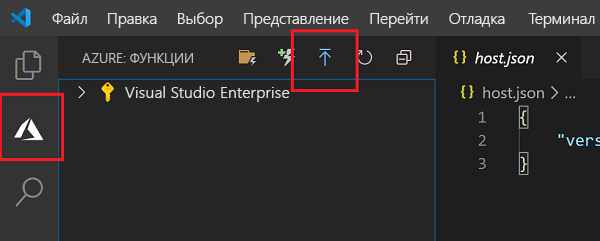

## Публикация проекта в Azure

В этом разделе показано создание приложения-функции и сопутствующих ресурсов в подписке Azure и последующее развертывание кода. 

> [!IMPORTANT]
> Публикация в существующее приложение-функцию перезаписывает содержимое этого приложения в Azure. 

1. Щелкните значок Azure на панели действий, а затем в области **Azure: Функции** выберите кнопку **Deploy to function app...** (Развертывание в приложение-функцию).

    

1. Введите следующие сведения по соответствующим запросам:

    + **Выбрать подписку**. Выберите подписку, которую нужно использовать. Если у вас только одна подписка, вы не увидите этот параметр.

    + **Select Function App in Azure** (Выбор приложения-функции в Azure). Выберите `+ Create new Function App`. (Не выбирайте параметр `Advanced`, так как он не рассматривается в этой статье.)
      
    + **Enter a globally unique name for the function app** (Ввод глобально уникального имени для приложения-функции). Введите имя, допустимое в пути URL-адреса. Имя, которое вы вводите, проверяется, чтобы убедиться, что оно уникально в функциях Azure. 
    
    ::: zone pivot="programming-language-python"
    + **Select a runtime** (Выбор среды выполнения). Выберите версию Python, которая запускалась локально. Вы можете использовать команду `python --version`, чтобы проверить установленную версию.
    ::: zone-end

    ::: zone pivot="programming-language-javascript,programming-language-typescript"
    + **Select a runtime** (Выбор среды выполнения). Выберите версию Node.js, которая запускалась локально. Вы можете использовать команду `node --version`, чтобы проверить установленную версию.
    ::: zone-end

    + **Select a location for new resources** (Выбор расположения для новых ресурсов).  Для повышения производительности выберите [регион](https://azure.microsoft.com/regions/) рядом с вами. 
    
1.  После завершения в вашей подписке создаются следующие ресурсы Azure с именами, производными от имени приложения-функции:
    
    + группу ресурсов — логический контейнер связанных ресурсов;
    + Стандартная учетная запись хранения Azure для сохранения состояния и других сведений о проектах.
    + План потребления, который определяет базовый узел для бессерверного приложения-функции; 
    + приложение-функцию — среду для выполнения кода функции. Приложение-функция позволяет группировать функции в логические единицы и упростить развертывание, масштабирование и совместное использование ресурсов, а также управление ими в рамках единого плана размещения.
    + Экземпляр Application Insights, подключенный к приложению-функции, который отслеживает использование бессерверной функции.

    После создания приложения-функции и применения пакета развертывания отобразится уведомление. 
    
1. Выберите **View Output** (Просмотреть выходные данные) в уведомлении, чтобы просмотреть результаты создания и развертывания ресурсов Azure. Если вы пропустили уведомление, щелкните значок колокольчика в правом нижнем углу, чтобы снова просмотреть его.

    
