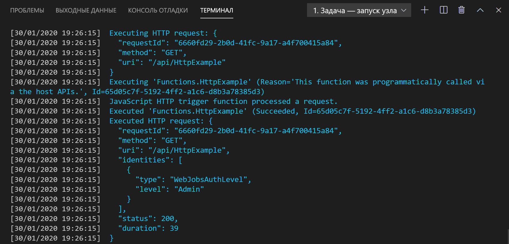

## Локальное выполнение функции

Visual Studio Code интегрируется с [Azure Functions Core Tools](../articles/azure-functions/functions-run-local.md), чтобы перед публикацией в Azure можно было запустить этот проект на локальном компьютере разработки.

1. Чтобы вызвать функцию, нажмите клавишу F5, чтобы запустить проект приложения-функции. Выходные данные основных инструментов отображаются на панели **Terminal** (Терминал).

1. Если вы еще не установили Azure Functions Core Tools, выберите команду **Установить** в приглашении. При установке Core Tools приложение запускается на панели **Терминал**. Отобразится URL-адрес конечной точки активируемой HTTP-запросом функции, которая выполняется локально. 

    

1. Запустив Core Tools, перейдите по указанному далее URL-адресу, чтобы выполнить запрос GET, который включает строку запроса `?name=Functions`.

    <http://localhost:7071/api/HttpExample?name=Functions>

1. Возвращается ответ, который в браузере выглядит следующим образом:

    

1. Сведения о запросе отображаются на панели **Терминал**.

    

1. Нажмите сочетание клавиш CTRL+C, чтобы остановить Core Tools и отключить отладчик.
