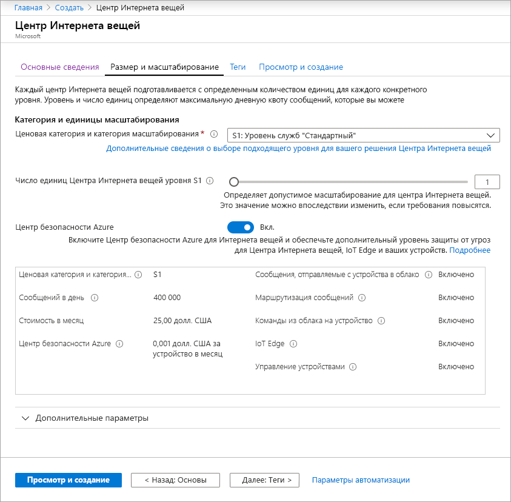

В этом разделе описывается создание центра Интернета вещей с помощью [портала Azure](https://portal.azure.com).

1. Войдите на [портале Azure](https://portal.azure.com).

1. Выберите **+Создать ресурс** и введите *Центр Интернета вещей* в поле **Поиск в Marketplace**.

1. В результатах поиска выберите **Центр Интернета вещей** и щелкните **Создать**.

1. Заполните следующие поля на вкладке **Основные сведения**.

   - **Подписка**: Выберите нужную подписку для концентратора.

   - **Группа ресурсов**. Выберите группу ресурсов или создайте новую. Чтобы создать новую, щелкните **Создать** и введите нужное имя. Чтобы выбрать существующую группу ресурсов, щелкните ее. Дополнительные сведения о группах ресурсов см. в статье об [управлении группами ресурсов в Azure Resource Manager](../articles/azure-resource-manager/manage-resource-groups-portal.md).

   - **Регион**. Выберите регион, в котором будет расположен концентратор. Выберите ближайшее к вам расположение.

   - **Имя Центра Интернета вещей**. Введите имя для концентратора. Оно должно быть глобально уникальным. Если введенное имя доступно, появится зеленая галочка.

   [!INCLUDE [iot-hub-pii-note-naming-hub](iot-hub-pii-note-naming-hub.md)]

   

1. По завершении выберите **Next: Size and scale** (Далее: размер и масштаб), чтобы продолжить создание концентратора.

   

    Этот экран позволяет задать следующие значения:

    - **Ценовая категория и категория масштабирования**. Выбранный уровень решения. В зависимости от количества необходимых функций и ежедневно отправляемых сообщений с помощью решения, можно выбрать несколько уровней. Для тестирования и оценки можно использовать уровень "Бесплатный". Он позволяет подключить к концентратору 500 устройств и отправлять до 8000 сообщений в день. Для каждой подписки Azure можно создать один Центр Интернета вещей на уровне "Бесплатный".

    - **Единицы центра Интернета вещей**. Допустимое число сообщений за единицу в сутки зависит от ценовой категории концентратора. Например, если концентратор должен поддерживать 700 000 входящих сообщений, следует выбрать две единицы уровня S1.
    Дополнительные сведения о других параметрах уровня см. в статье [Масштабирование решения для Центра Интернета вещей](../articles/iot-hub/iot-hub-scaling.md).

    - **Дополнительные параметры Settings** > **С устройства в облако**: Это свойство привязывает сообщения, отправляемые с устройства в облако, к числу одновременно работающих модулей чтения этих сообщений. Для большинства концентраторов достаточно четырех разделов.

1. Для работы с этим руководством подтвердите значения по умолчанию, а затем выберите **Проверить и создать**, чтобы проверить выбранные параметры. Отобразится примерно следующий экран.

   

1. Щелкните **Создать**, чтобы создать концентратор. Создание центра занимает несколько минут.
