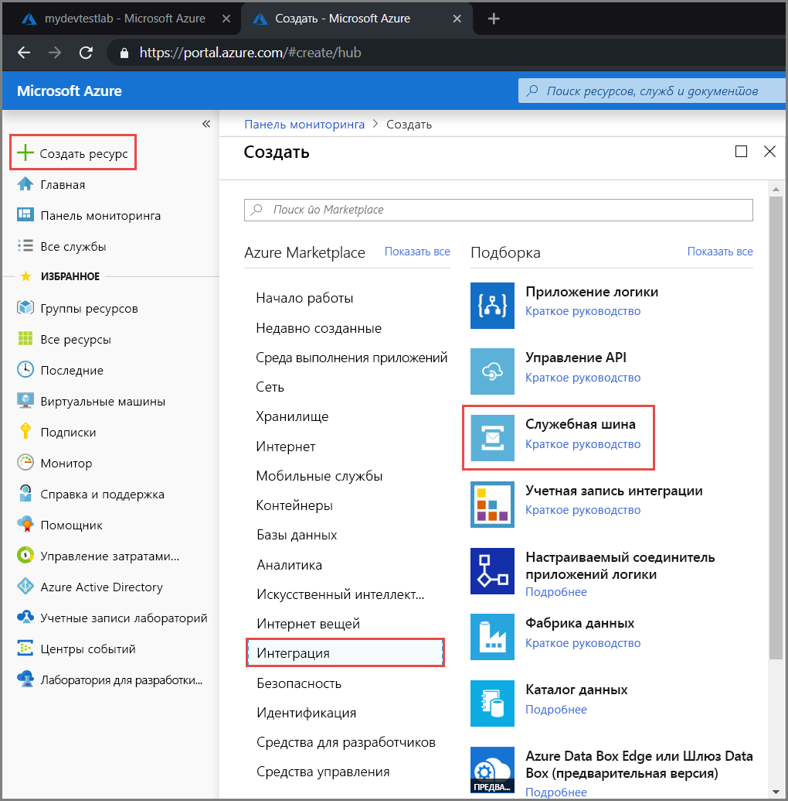
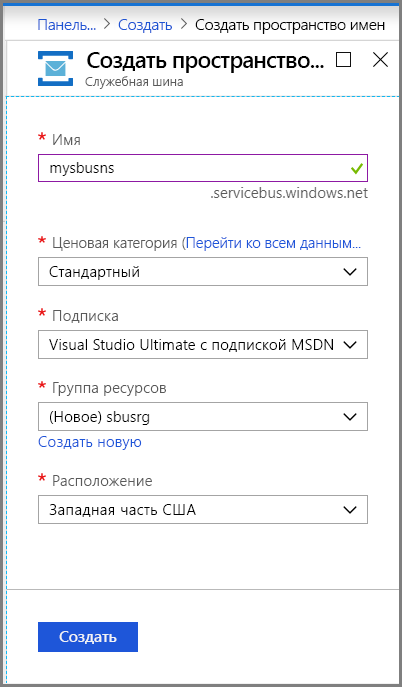
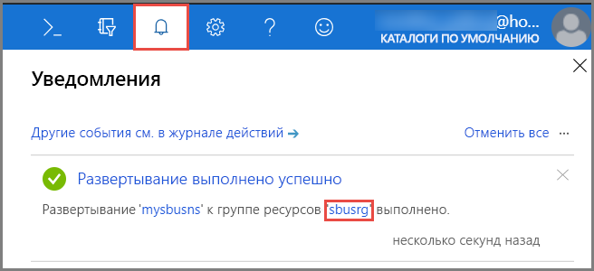
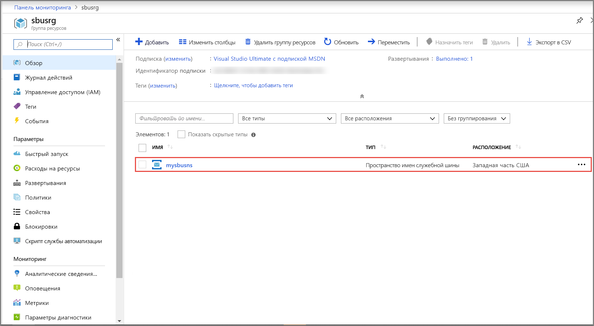
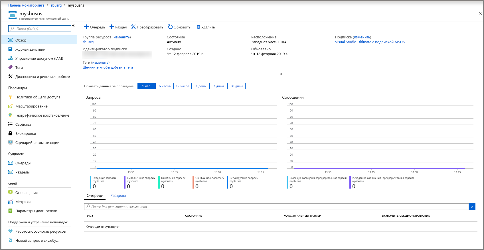
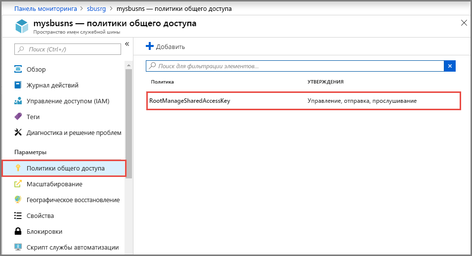
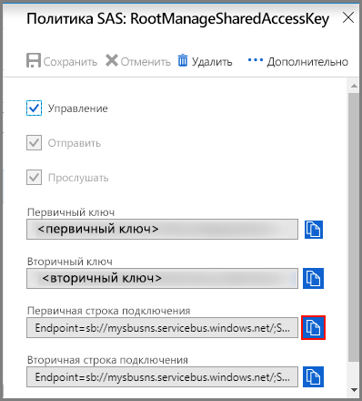

## Создание пространства имен на портале Azure
Чтобы приступить к использованию сущностей обмена сообщениями в служебной шине в Azure, сначала необходимо создать пространство имен с уникальным для Azure именем. Пространство имен предоставляет контейнер для адресации ресурсов служебной шины в вашем приложении.

Создание пространства имен службы:

1. Войдите на [портал Azure](https://portal.azure.com)
2. На портале на панели навигации слева выберите **+ Создать ресурс**, **Интеграция**, а затем — **Служебная шина**.

    
3. В диалоговом окне **Создание пространства имен** выполните следующие действия: 
    1. Введите **имя для пространства имен**. Система немедленно проверяет, доступно ли оно. Список правил для именования пространств имен см. в статье об [API REST для создания пространства имен](/rest/api/servicebus/create-namespace).
    2. Выберите ценовую категорию ("Базовый", "Стандартный" или "Премиум") для пространства имен. Чтобы использовать [разделы и подписки](../articles/service-bus-messaging/service-bus-queues-topics-subscriptions.md#topics-and-subscriptions), выберите категорию "Стандартный" или "Премиум". Разделы и подписки не поддерживаются в ценовой категории "Базовый".
    3. Если вы выбрали ценовую категорию **Премиум**, выполните следующие действия: 
        1. Укажите число **единиц обмена сообщениями**. В категории "Премиум" обеспечивается изоляция ресурсов на уровне ЦП и памяти, так что рабочая нагрузка выполняется изолированно от других. Контейнер ресурса называется единицей обмена сообщениями. Пространству имен ценовой категории "Премиум" выделяется по крайней мере одна единица обмена сообщениями. Для каждого пространства имен служебной шины Premium можно выбрать 1, 2 или 4 единицы обмена сообщениями. Дополнительные сведения см. в статье [Уровни обмена сообщениями через служебную шину Premium и Standard](../articles/service-bus-messaging/service-bus-premium-messaging.md).
        2. Укажите, хотите ли вы сделать пространство имен **избыточным в пределах зоны**. Избыточность в пределах зоны обеспечивает улучшенную доступность за счет распределения реплик по зонам доступности внутри одного региона без дополнительной платы. Дополнительные сведения см. в статье [о зонах доступности в Azure](../articles/availability-zones/az-overview.md).
    4. Выберите **подписку** Azure, в которой будет создано пространство имен.
    5. Выберите существующую **группу ресурсов**, в которую будет включено это пространство имен, или создайте новую.      
    6. Укажите **расположение** — регион для размещения пространства имен.
    7. Нажмите кнопку **Создать**. Теперь система создает пространство имен и включает его. Возможно, вам придется подождать несколько минут, пока система выделит ресурсы для вашей учетной записи.
   
        
4. Убедитесь, что пространство имен служебной шины успешно развернуто. Чтобы просмотреть уведомления, выберите **значок колокольчика ("Оповещения")** на панели инструментов. Выберите **имя группы ресурсов** в уведомлении, как показано на рисунке. Отобразится группа ресурсов, которая содержит пространство имен служебной шины.

    
5. На странице своей **группы ресурсов** выберите **пространство имен служебной шины**. 

    
6. Вы увидите домашнюю страницу пространства имен служебной шины. 

    

## Получение строки подключения 
При создании нового пространства имен автоматически создается начальное правило подписанного URL-адреса (SAS) и связанная с ним пара первичного и вторичного ключей, каждый из которых предоставляет полный контроль над всеми аспектами пространства имен. Сведения о том, как в дальнейшем создавать правила с ограниченными правами для постоянных отправителей и получателей, см. в статье [Аутентификация и авторизация в служебной шине](../articles/service-bus-messaging/service-bus-authentication-and-authorization.md). Чтобы скопировать первичный и вторичный ключи для пространства имен, выполните следующие действия: 

1. Щелкните **Все ресурсы**, а затем щелкните созданное имя пространства имен.
2. В окне пространства имен щелкните **Политики общего доступа**.
3. В окне **Политики общего доступа** щелкните **RootManageSharedAccessKey**.
   
    
4. В окне **Policy: RootManageSharedAccessKey** (Политика: RootManageSharedAccessKey) нажмите кнопку копирования рядом с полем **Первичная строка подключения**, чтобы скопировать строку подключения в буфер обмена для последующего использования. Вставьте на время эти значения в Блокноте или любом другом месте.
   
    
5. Повторите предыдущий шаг, скопировав и вставив значение **первичного ключа** во временное расположение для последующего использования.

<!--Image references-->

