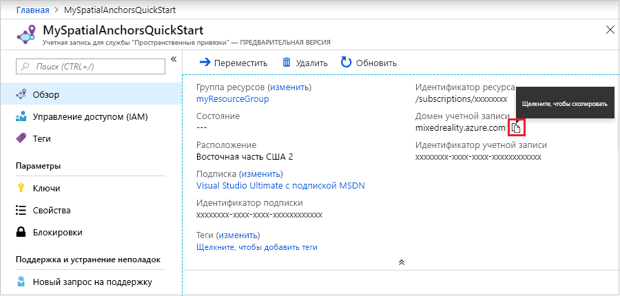

## Создание ресурса Пространственных привязок

Перейдите на <a href="https://portal.azure.com" target="_blank">портал Azure</a>.

В левой области навигации портала Azure нажмите **Создать ресурс**.

Выполните поиск по запросу **Пространственные привязки** с помощью поля поиска.

   

Нажмите **Пространственные привязки**. В диалоговом окне выберите **Создать**.

В диалоговом окне **Учетная запись Пространственных привязок**:

- Введите уникальное имя ресурса, используя обычные буквенно-цифровые символы.
- Выберите подписку, к которой нужно присоединить ресурс.
- Создайте группу ресурсов, нажав **Создать**. Назовите ее **myResourceGroup** и нажмите **ОК**.
      [!INCLUDE [resource group intro text](resource-group.md)]
- Выберите расположение (регион), в котором будет размещен ресурс.
- Выберите **Создать**, чтобы начать создание ресурса.

   

После создания ресурса на портале Azure отобразится оповещение о завершении развертывания. Щелкните **Перейти к ресурсу**.

Теперь можно просмотреть свойства ресурса. Скопируйте значение **идентификатора учетной записи** ресурса в текстовый редактор, так как оно понадобится позднее.

   

Скопируйте также значение **домена учетной записи** ресурса в текстовый редактор, так как оно понадобится позднее.

   

В меню **Параметры** выберите **Ключ**. Скопируйте значение **первичного ключа** в текстовый редактор. Это значение `Account Key`. Он понадобится вам позднее.

   
