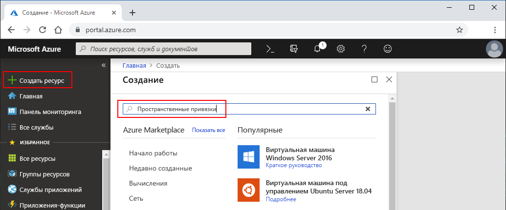
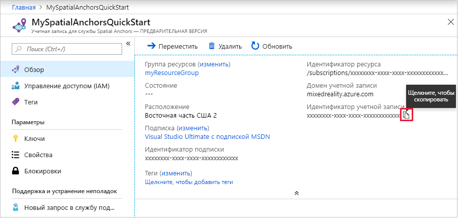
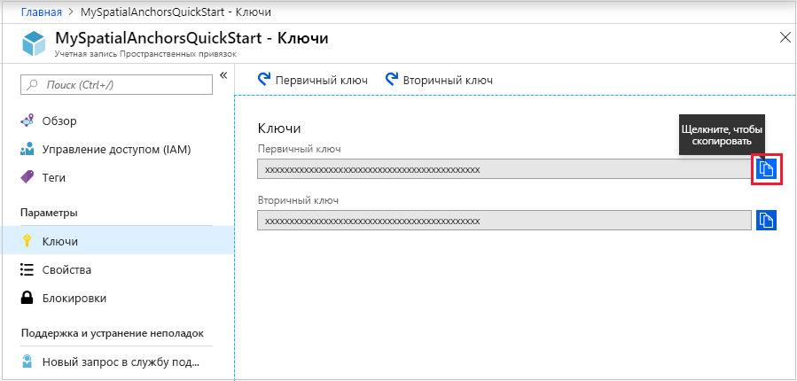

## <a name="create-a-spatial-anchors-resource"></a>Создание ресурса Пространственных привязок

### <a name="portal"></a>[Портал](#tab/azure-portal)

Перейдите на <a href="https://portal.azure.com" target="_blank">портал Azure</a>.

В области слева выберите **Создать ресурс**.

Выполните поиск по запросу **Пространственные привязки** с помощью поля поиска.



Выберите **Пространственные привязки**, а затем щелкните **Создать**.

В области **Учетная запись Пространственных привязок** выполните следующие действия.

* Введите уникальное имя ресурса, используя обычные буквенно-цифровые символы.  
* Выберите подписку, к которой нужно присоединить ресурс.  
* Создайте группу ресурсов, нажав **Создать**. Назовите ее **myResourceGroup** и нажмите **ОК**.  

  [!INCLUDE [resource group intro text](resource-group.md)]
  
* Выберите расположение (регион), в котором будет размещен ресурс.  
* Выберите **Создать**, чтобы начать создание ресурса.


После создания ресурса на портале Azure отобразится оповещение о завершении развертывания. 
   


Выберите **Перейти к ресурсу**. Теперь можно просмотреть свойства ресурса. 
   
Скопируйте значение **идентификатора учетной записи** ресурса в текстовый редактор для дальнейшего использования.



Скопируйте также значение **домена учетной записи** ресурса в текстовый редактор для дальнейшего использования.


В меню **Параметры** выберите **Ключ**. Скопируйте значение **первичного ключа** (**ключа учетной записи**) в текстовый редактор для дальнейшего использования.



### <a name="azure-cli"></a>[Azure CLI](#tab/azure-cli)

Чтобы подготовить среду для Azure CLI, выполните указанные ниже действия.

[!INCLUDE [azure-cli-prepare-your-environment-no-header.md](azure-cli-prepare-your-environment-no-header.md)]

1. После входа выполните команду [az account set](/cli/azure/account#az_account_set), чтобы выбрать подписку, в которой нужно задать учетную запись пространственных привязок:

   ```azurecli
   az account set --subscription 00000000-0000-0000-0000-000000000000
   ```

1. Выполните команду [az group create](/cli/azure/group#az_group_create), чтобы создать группу ресурсов, или примените существующую группу ресурсов:

   ```azurecli
   az group create --name myResourceGroup --location eastus2
   ```

   [!INCLUDE [resource group intro text](resource-group.md)]

   Вы можете просмотреть текущие учетные записи пространственных привязок для группы ресурсов с помощью команды [az spatial-anchors-account list](/cli/azure/ext/mixed-reality/spatial-anchors-account#ext_mixed_reality_az_spatial_anchors_account_list):

   ```azurecli
   az spatial-anchors-account list --resource-group myResourceGroup
   ```

   Вы также можете просмотреть учетные записи пространственных привязок для своей подписки:

   ```azurecli
   az spatial-anchors-account list
   ```

1. Выполните команду [az spatial-anchors-account create](/cli/azure/ext/mixed-reality/spatial-anchors-account#ext_mixed_reality_az_spatial_anchors_account_create), чтобы создать учетную запись пространственных привязок:

   ```azurecli
   az spatial-anchors-account create --resource-group myResourceGroup --name MySpatialAnchorsQuickStart --location eastus2
   ```

1. Просмотрите свойства ресурса с помощью команды [az spatial-anchors-account show](/cli/azure/ext/mixed-reality/spatial-anchors-account#ext_mixed_reality_az_spatial_anchors_account_show):

   ```azurecli
   az spatial-anchors-account show --resource-group myResourceGroup --name MySpatialAnchorsQuickStart
   ```

   Скопируйте значение **идентификатора учетной записи** для ресурса и значение **домена учетной записи** для ресурса в текстовый редактор (они понадобятся позже).

1. Выполните команду [az spatial-anchors-account key show](/cli/azure/ext/mixed-reality/spatial-anchors-account/key#ext_mixed_reality_az_spatial_anchors_account_key_show), чтобы получить первичный и вторичный ключи:

   ```azurecli
   az spatial-anchors-account key show --resource-group myResourceGroup --name MySpatialAnchorsQuickStart
   ```

   Скопируйте значения ключей в текстовый редактор (они понадобятся позже).

   Если необходимо повторно создать ключи, выполните команду [az spatial-anchors-account key renew](/cli/azure/ext/mixed-reality/spatial-anchors-account/key#ext_mixed_reality_az_spatial_anchors_account_key_renew):

   ```azurecli
   az spatial-anchors-account key renew --resource-group myResourceGroup --name example --key primary
   az spatial-anchors-account key renew --resource-group myResourceGroup --name example --key secondary
   ```

Вы можете удалить учетную запись с помощью команды [az spatial-anchors-account delete](/cli/azure/ext/mixed-reality/spatial-anchors-account#ext_mixed_reality_az_spatial_anchors_account_delete):

```azurecli
az spatial-anchors-account delete --resource-group myResourceGroup --name MySpatialAnchorsQuickStart
```

---
