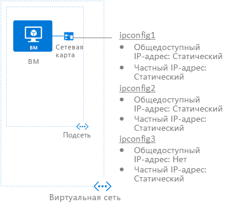

## Сценарий
Создается виртуальная машина с одним сетевым адаптером. Она подключается к виртуальной сети. Виртуальной машине нужно присвоить три разных *частных* и два *общедоступных* IP-адреса. IP-адреса назначаются следующим IP-конфигурациям.

* **IPConfig-1:** назначает *статический* частный IP-адрес и *статический* общедоступный IP-адрес.
* **IPConfig-2:** назначает *статический* частный IP-адрес и *статический* общедоступный IP-адрес.
* **IPConfig-3:** назначает только *статический* частный IP-адрес.
  
    

Когда создается сетевой адаптер, с ним связываются IP-конфигурации. Когда создается виртуальная машина, к ней подключается сетевой адаптер. Типы IP-адресов в этом сценарии указаны только для примера. Вы можете использовать любые типы IP-адресов и назначений, какие вам потребуются.

> [!NOTE]
> Хотя в этой статье все IP-конфигурации назначаются одному сетевому интерфейсу, вы можете аналогичным образом назначить несколько IP-конфигураций любому сетевому интерфейсу, прикрепленному к виртуальной машине с несколькими сетевыми адаптерами. Дополнительные сведения о создании виртуальной машины с несколькими сетевыми интерфейсами см. в [этой статье](../articles/virtual-machines/windows/multiple-nics.md).