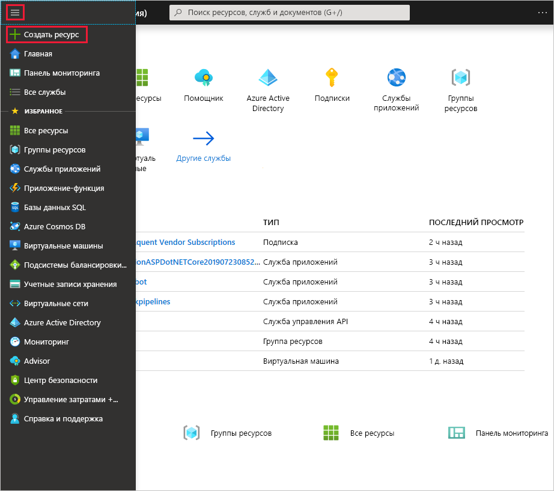

1. В меню на [портале Azure](https://portal.azure.com) выберите **Создать ресурс**. 

   
2. В поле **Поиск по Marketplace** введите "шлюз виртуальной сети". Найдите **шлюз виртуальной сети** в списке результатов и выберите соответствующую запись. На странице **Шлюз виртуальной сети** выберите **Создать**. Откроется страница **Создание шлюза виртуальной сети**.
3. На вкладке **Основные сведения** укажите значения для шлюза виртуальной сети.

   

   

   **Сведения о проекте**

   - **Подписка**: В раскрывающемся списке выберите нужную подписку.
   - **Группа ресурсов**. Этот параметр заполняется автоматически при выборе виртуальной сети на этой странице.

   **Сведения об экземпляре**

   - **Имя**. Назовите свой шлюз. Имя шлюза должно отличаться от имени подсети шлюза. Это имя объекта шлюза, который создается.
   - **Регион**. Выберите регион, в котором требуется создать ресурс. Шлюз должен находиться в том же регионе, где и виртуальная сеть.
   - **Тип шлюза**. Выберите **VPN**. VPN-шлюзы используют тип шлюза виртуальной сети **VPN**.
   - **Тип VPN**. Выберите тип VPN, который указан для конфигурации. Для большинства конфигураций требуется тип VPN на основе маршрута.
   - **SKU**. Выберите номер SKU шлюза из раскрывающегося списка. Номера SKU, перечисленные в раскрывающемся списке, зависят от выбранного типа VPN. Дополнительные сведения о номерах SKU шлюзов см. в разделе [SKU шлюзов](../articles/vpn-gateway/vpn-gateway-about-vpn-gateway-settings.md#gwsku).
   - **Поколение.** Сведения о создании VPN-шлюза см. в разделе [Номера SKU для шлюза](../articles/vpn-gateway/vpn-gateway-about-vpngateways.md#gwsku).
   - **Виртуальная сеть.** В раскрывающемся списке выберите виртуальную сеть, в которую будет добавлен этот шлюз.
   - **Диапазон адресов подсети шлюза**. Это поле отображается, только если в виртуальной сети нет подсети шлюза. По возможности задайте диапазон с количеством единичных разрядов в маске подсети, равным 27 или больше (/26, /25 и т. д.). Не рекомендуется создавать диапазоны с количеством единиц в маске меньше 28. Если у вас уже есть подсеть шлюза, вы можете просмотреть сведения о параметре GatewaySubnet, перейдя к своей виртуальной сети. Щелкните **Подсети**, чтобы посмотреть диапазон. Если вы хотите изменить диапазон, можно удалить и создать заново параметр GatewaySubnet.

   **Общедоступный IP-адрес**. Этот параметр задает объект общедоступного IP-адреса, который связывается с VPN-шлюзом. Общедоступный IP-адрес динамически назначается этому объекту при создании VPN-шлюза. Общедоступный IP-адрес изменяется только после удаления и повторного создания шлюза. При изменении размера, сбросе или других внутренних операциях обслуживания или обновления IP-адрес VPN-шлюза не изменяется.

     - **Общедоступный IP-адрес**. Оставьте параметр **Создать** выбранным.
     - **Имя общедоступного IP-адреса**. В текстовом поле укажите имя общедоступного IP-адреса.
     - **Назначение.** VPN-шлюз поддерживает только динамическое назначение IP-адресов.

   **Режим "активный — активный".** Параметр **Включить режим " активный — активный"** следует использовать только в том случае, если вы настраиваете конфигурацию шлюза в режиме "активный — активный". В противном случае не выбирайте этот параметр.

   Не выбирайте параметр **Настроить ASN BGP**, кроме случаев, когда его выбор обусловлен используемой конфигурацией. Если этот параметр необходим, по умолчанию для ASN устанавливается значение 65515, которое при необходимости можно изменить.
4. Выберите **Просмотр и создание**, чтобы выполнить проверку. Затем щелкните **Создать**, чтобы развернуть шлюз виртуальной частной сети. Это может занять до 45 минут. Состояние развертывания можно отслеживать на странице обзора шлюза.

После создания шлюза вы можете просмотреть назначенный ему IP-адрес в разделе сведений о виртуальной сети на портале. Шлюз будет отображаться как подключенное устройство.
