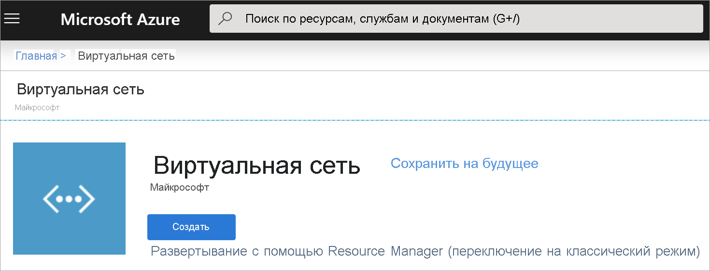

Чтобы создать виртуальную сеть с помощью модели развертывания Resource Manager и портала Azure, следуйте приведенным ниже инструкциям. См. дополнительные сведения о [виртуальных сетях](../articles/virtual-network/virtual-networks-overview.md).

>[!NOTE]
>Для подключения виртуальной сети к локальному расположению обратитесь к администратору локальной сети, чтобы выделить диапазон IP-адресов, который будет использоваться специально для этой виртуальной сети. Если повторяющийся диапазон адресов существует на обеих сторонах VPN-подключения, трафик будет маршрутизироваться неправильно. Кроме того, если вы хотите подключить виртуальную сеть к другой виртуальной сети, адресное пространство не должно пересекаться с другой виртуальной сетью. Спланируйте конфигурацию сети соответствующим образом.
>
>

1. Войдите на [портал Azure](https://portal.azure.com).
1. В окне **Поиск ресурсов, служб и документов (G +/)** введите *виртуальную сеть*.

   
1. В результатах **Marketplace** выберите **Виртуальная сеть** .

   
1. На странице **Виртуальная сеть** нажмите кнопку **создать**.

   
1. После нажатия кнопки Создать откроется страница **Создание виртуальной сети** .

   
1. На странице **Создание виртуальной сети** настройте параметры виртуальной сети. Если введенные в полях значения допустимы, красный восклицательный знак сменится зеленой галочкой. Некоторые значения автоматически заполнены. Вы можете заменить их собственными значениями:

   - **Имя**. Введите имя виртуальной сети.
   - **Адресное пространство**. Введите адресное пространство. Если их несколько, введите первое адресное пространство. Дополнительные адресные пространства можно добавить позже, после создания виртуальной сети. Если для вашей конфигурации требуется адресное пространство IPv6, установите флажок, чтобы ввести эти сведения.
   - **Подписка**. Убедитесь, что указана правильная подписка. Подписки можно менять с помощью раскрывающегося списка.
   - **Группа ресурсов**. Выберите существующую группу ресурсов или создайте новую, введя ее имя для новой группы ресурсов. Если вы создаете группу ресурсов, укажите для нее имя, которое будет использоваться в вашей конфигурации. Дополнительные сведения о группах ресурсов см. в статье [Общие сведения об Azure Resource Manager](../articles/azure-resource-manager/management/overview.md#resource-groups).
   - **Расположение**. Выберите расположение для виртуальной сети. Расположение определяет, где будут находиться ресурсы, развертываемые в этой виртуальной сети.
   - **Подсеть**. Добавьте **имя** подсети и **диапазон адресов**подсети. Дополнительные подсети можно добавить позже, после создания виртуальной сети.
   - **Защита от атак DDoS**. Выберите **базовый**, если вы не хотите использовать стандартную службу.
   - **Конечные точки службы**. Вы можете оставить этот параметр **отключенным**, если в конфигурации не указан этот параметр.
   - **Брандмауэр**. Вы можете оставить этот параметр **отключенным**, если в конфигурации не указан этот параметр.
1. Нажмите кнопку **создать** , чтобы начать развертывание виртуальной сети.
